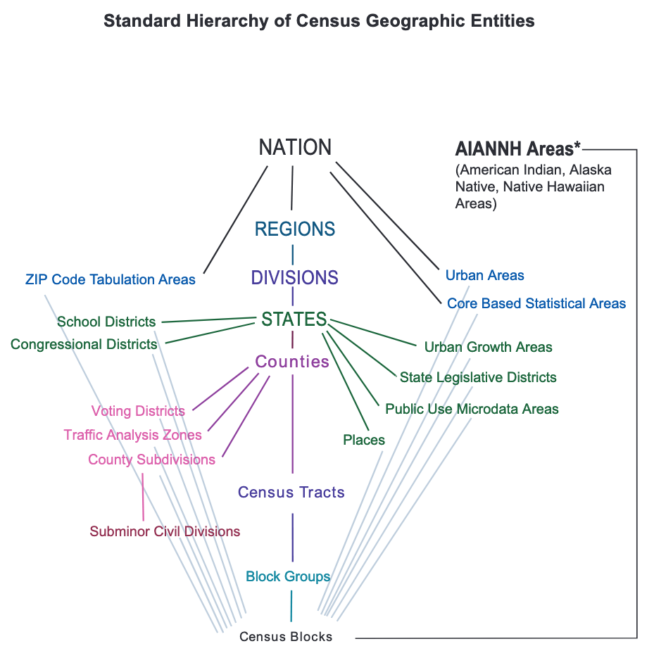

# Introduction

This section will cover the basics of the US Census, geographic divisions, and how to access Census data.

## The US Census

The United States Constitution mandates a complete count of the US population be taken every ten years. The first Census was conducted in 1790, and population counts were (and still are) used to apportion seats for the House of Representatives.

Overtime, the decennial Census expanded to collect data on income, education, language, housing, and more. The Bureau also began collecting data more frequently through [new surveys](https://www.census.gov/programs-surveys/surveys-programs.html "List of All US Census Surveys & Programs"), including the **American Community Survey (ACS)**. Unlike the decennial Census, the ACS does not attempt to precisely count all US residents. Rather, this survey is mailed annually to approximately 3.5 million households, representing \~3% of the US population. The ACS is now the premier source of detailed demographic information for the US.

Two ACS datasets are made public each year: the 1-year ACS and the 5-year ACS.

-   **1-Year ACS**

    -   Covers areas with populations of 65,000+.

    -   Contains data from one year; higher margin of error.

-   **5-Year ACS**

    -   Covers geographies down to the block group level.

    -   Moving average of data over a 5-year period; lower margin of error.

Due to COVID-related data collection problems, the 2020 1-year ACS data will not be released, replaced by experimental estimates.

### Geographies

Census data is published for a range of geographies, from the nation as a whole, down to neighborhood-scale census blocks. The hierarchy used by the Census Bureau is shown below.[@uscensusbureau2017]

Let's use Memphis as an example.[^intro-1]

[^intro-1]: Information on region and division were found [on these Census Bureau maps](https://www2.census.gov/geo/pdfs/maps-data/maps/reference/us_regdiv.pdf "Census Regions and Divisions of the United States").

-   **Nation**: United States
-   **Region**: South (Region 3)
-   **Division**: East South Central (Division 6)
-   **State**: Tennessee (FIPS Code 47)
-   **County**: Shelby
-   **Place**: Memphis

Counties are further subdivided into census tracts; tracts into block groups; block groups into blocks.

<!--# return to this section after Ch 6. add leaflet map of various Memphis geographies. -->

### Accessing Data

The simplest way to access Census data is through [data.census.gov](https://data.census.gov/cedsci/), where users can enter custom queries and download datasets. Bulk ZIP files are also available on the Bureau's [FTP site](https://www2.census.gov/programs-surveys/).

Since 2012, Census data is available to the public through APIs. Datasets are assigned a base web address, such as `https://api.census.gov/data/2010/dec/sf1` for the 2010 decennial Census. Users can specify which dataset they need through queries. For example, the query `?get=P001001,NAME&for=county:*&in=state:47` asks to see population data for all counties in Tennessee. This data can be seen [here](https://api.census.gov/data/2010/dec/sf1?get=P001001,NAME&for=county:*&in=state:47).

Many R packages make it easier to interact with the Census API, such as **tidycensus**. Those who wish to access the Census API through R packages need to request a [**Census API key**](https://api.census.gov/data/key_signup.html), available for free.

## R

[**R**](https://cloud.r-project.org/) is a powerful, popular programming language, available as a free and open-source software ([FOSS](https://en.wikipedia.org/wiki/Free_and_open-source_software)). It is possible to work solely with R, but it is typically paired with [**RStudio**](https://www.rstudio.com/products/rstudio/download/), another FOSS. The basics of R and RStudio will not be covered in this book. If you are completely new to these programs, I recommend you read the brief rundown in [Kyle Walker's book](https://walker-data.com/census-r/the-united-states-census-and-the-r-programming-language.html#what-is-r) and read/bookmark/work through [R for Data Science](https://r4ds.had.co.nz/).

An R **package** is a collection of functions, data, and documentation that extends the capabilities of base R.[@wickham2017, 1.4.3] Anyone can make a package and submit it for publication (or host it on their personal GitHub page).[@walker2021, 1.4.4] This means R can quickly evolve and develop as the community sees fit, unlike commercial software. However, this can make R feel fragmented and overwhelming to new users.

### tidyverse

The **tidyverse** is a collection of packages that share a common philosophy and are designed to work together naturally, addressing problems of fragmentation. These packages are designed to address frequent data analysis tasks, including data wrangling and visualization, using a common syntax.

Key to the tidyverse is the idea of **tidy data**.[@wickham2014] A dataset is messy or tidy depending on how rows, columns, and values are organized. There are three rules which make data tidy:

1.  Each variable must have its own column.
2.  Each observation must have its own row.
3.  Each value must have its own cell.

*Messy data* is any other arrangement of the data. These rules are visualized below.[@wickham2017, 12.2]

Keeping data in a tidy format creates a consistent way of storing data and makes tidyverse packages easy to use. This book will contain many examples of tidy data.

### tidycensus

The **tidycensus** package, first released in 2017, aims to make Census data available to R users in a tidyverse-friendly format.[@walker2021, 2] The package also was designed to streamline spatial analysis by allowing users to request geometric attributes for their Census data.

**tidycensus** is not a comprehensive portal to Census Bureau API. Instead, selected datasets are available through core functions:

-   `get_decennial()`, for the decennial Census APIs. Available for 2000, 2010, (and 2020 on 9/30/2021)

-   `get_acs()` for the American Community Survey.

    -   1-year ACS available from 2005

    -   5-year ACS available from 2005-2009

-   `get_estimates()`, for the Population Estimates APIs.

-   `get_pums()`, for the ACS Public Use Microdata Sample APIs.

-   `get_flows()`, for the ACS Migration Flows APIs.

These functions allow users to easily and quickly access Census data.
