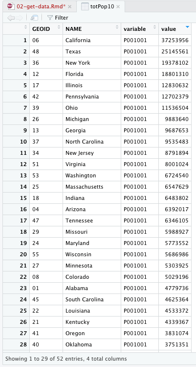

# Getting Census Data

## Getting Data

This section will cover how to collect various types of Census data using **tidycensus**. If this is your first time using tidycensus, run `install.packages("tidycensus")`.

You will also need a Census API key, available at <https://api.census.gov/data/key_signup.html>. The key is required every time you call data; run `census_api_key()` with `install = TRUE` to automatically include the key in calls.

```{r libraryTidycensus, message=FALSE, warning=FALSE}
library(tidyverse)
library(tidycensus)
# census_api_key("YOUR KEY GOES HERE", install = TRUE)
```

### Decennial Census

To get data from the decennial Census, users must specify a `geography` and one or more `variables`, such as population. A `year` is optional; if omitted, it will default to the most recently available dataset. The following code gets the total population from all states, plus D.C. and Puerto Rico, from the 2010 decennial Census.

```{r totPop10, message=FALSE, warning=FALSE}
totPop10 <- get_decennial(
  geography = "state",
  variables = "P001001",
  year = 2010,
  cache_table = TRUE
)
```

In RStudio, the table `totPop10` appears under the *Environment* tab. Users can click on the table to open it and see the full list of states. Clicking on the `value` column name sorts state population by ascending or descending order.



According to the 2010 decennial Census, there were 6,346,105 people living in Tennessee, making it the 17th most populous state.

Slightly changing the code allows us to find the 2000 population.

```{r totPop00, message=FALSE, warning=FALSE}
totPop00 <- get_decennial(
  geography = "state",
  variables = "P001001",
  year = 2000,
  cache_table = TRUE
)
totPop00 %>% filter(NAME == "Tennessee")
```

There were 5,689,283 people in Tennessee in 2000.

We can then join the tables and find the population change of all states over the decade. The below function:

1.  First, joins the tables by the `NAME` variable (you could also use `GEOID`).
2.  When the tables are joined, matching column names are automatically relabeled (such as `value.x` and `value.y`). To avoid confusion, I used `rename()` to change the column names.
3.  The `mutate()` function was used to create a new column called `popChg`. The values of the new column were found by subtracting `pop10` and `pop00`.
4.  `select()` is used to narrow the table to only show relevant columns (excluding `GEOID` and `variable` columns).
5.  I used `arrange()` to sort the table by descending `popChg`. This means states with the largest change in population appear at the top.
6.  Finally, `head()` previews the table and allows us to select how many rows to view.

```{r totPop}
totPop <- totPop00 %>% 
  left_join(totPop10, by = "NAME") %>% 
  rename(pop00 = value.x,
         pop10 = value.y) %>% 
  mutate(popChg = pop10 - pop00) %>% 
  select(NAME, pop00, pop10, popChg) %>% 
  arrange(desc(popChg))
head(totPop, 15)
```

From 2000 to 2010, Tennessee's total population rose by 656,822 people. This was the 11th highest gain in total population of all states (plus D.C. and Puerto Rico). Before moving on, let's also calculate the percent change in population to see which states grew the fastest.

```{r}
totPop <- totPop %>% 
  mutate(pctChg = (pop10-pop00)/pop00) %>% 
  arrange(desc(pctChg))
totPop
```

The fastest growing states during the 2000s were in the southwest: Nevada, Arizona, and Utah. Meanwhile, Tennessee's population increased by 11.54% from 2000 to 2010, making it the 19th fastest growing state.

### American Community Survey

The American Community Survey is accessed through the `get_acs()` function. The
